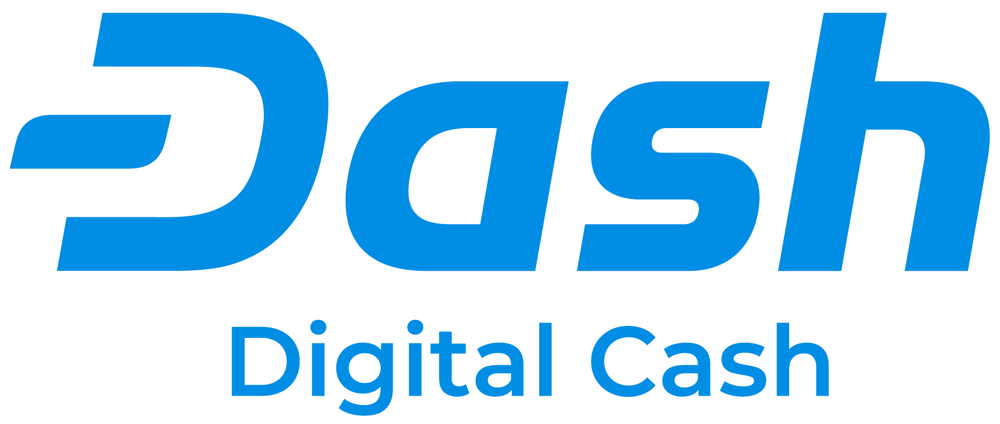
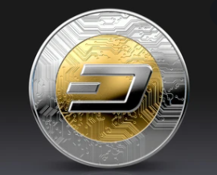

___

# Overview and Origin!

## > What is Dash?

*Dash is Digital Cash, a user focused cryptocurrency, which you can spend anywhere, anytime and any amount for fees less than 1 cent. Users may decide to take advantage of the optional privacy Dash offers.*

**History of Dash:**

*In January of 2014, Evan Duffield created XCoin, which then became DarkCoin and finally Dash. He created the cryptocurrency due to privacy concerns in the Bitcoin network. He wanted to create a supremely private cryptocurrency with faster confirmations.*

*Dash is completely decentralised, which means that it doesn't require a third party (such as a bank) to operate. A record, or ledger, of all transactions and account holdings are kept on thousands of individually owned computers around the world, which constantly check each other for corresponding activity. This effectively disintermediates (in this case, we mean that power is removed from a single authority – technologically) the network and ensures fair play.*

## > Business Activities:

**What specific financial problem is the company or project trying to solve?**

*Developing countries such as Africa, the Middle East and South America, have suffered restrictions to the benefits of digitalization and globalization, ranging from poor access to outright exclusion. Blockchain technology is however encompassing and it has great potential for applications in different areas of private and public life. From the prospect of eradicating corruption and mismanagement in public sectors to improve the ease of doing businesses, blockchain technology is one that can help them actualize a transformation. The potential of the technology is one that can even make developing countries leapfrog others in their development.*

*A direct implication of the technology is the financial inclusion it provides for the unbanked populace. Subsaharan Africa has a large number of unbanked people and according to the Global Findex report, over half of the adults in Nigeria and Ethiopia are unbanked, while about one-third of Kenyans are financially excluded. Of the 25 countries that host 73% of unbanked adults globally, almost half of those countries are from the African continent, with eleven countries namely; Côte d'Ivoire, Democratic Republic of Congo, Egypt, Ethiopia, Kenya, Morocco, Mozambique, Nigeria, Rwanda, South Africa, and Zambia, as reported by the Universal Financial Access 2020. People remain unbanked because of the costs, the need for extensive paperwork and documentation and the distance to traditional financial institutions; blockchain technology can be used to address these issues.*

*The technology can help integrate the continent internal currency exchange system. Internal trade between African countries is more difficult than transacting outside the continent at times, particularly because of the absence of effective currency exchange platforms for African trade. Blockchain technology can act as an enabler for improved African trade, while also positioning her better for the global economy through the ease the technology brings to global trade.*

*Then, this is when Dash comes into place, Using the blockchain technology, Dash offers instant, peer-to-peer payments with micro-fees and is accepted by thousands of merchants worldwide. The Dash community is pushing for adoption of Dash, particularly by merchants through a series of programs and its ongoing innovation. Across Africa, Asia, Europe and the rest of the world, Dash is being evangelized in a way that stimulates interest and motivates traders to embrace it.*

*Dash is accepted by many merchants globally. These merchants have adopted Dash as a means of payment mainly because of the fees required for a successful transfer.*

*Dash is utilizing the power of education and entertainment to push for its adoption. There are physical Dash communities, regular conferences, meetups, student organizations, trader-get-togethers and many more platforms for enlightenment and continued education. Education has proved to be very effective because it aids understanding of the blockchain technology and its merit, gives users a grasp of cryptocurrency, makes them appreciate the efficiency of Dash and teaches them how to use it.*

*By utilizing a distributed protocol, Dash can send money cheaply and quickly anywhere in the world. As long as you have the internet, you can use Dash no matter which country you're in, what time it is and regardless of how much you want to send. The internet allows us to send information quickly, easily and ubiquitously (anywhere in the world); Dash allows us to send value quickly, easily and ubiquitously.*  

**What solution does this company offer that their competitors do not or cannot offer? (What is the unfair advantage they utilize?**

* Dash is a payment system that exists only digitally and works differently than the systems we are used to. Dash removes third parties (like banks and credit card companies) from transactions. No one but you can control your funds. Dash was designed to have low transaction fees and quick transaction times. The Dash network protects your identity. It does not use names to identify accounts – instead, they are identified by random strings of numbers and letters.

* Treasury system: Another unique feature of Dash is the treasury system. With most other cryptocurrencies, all newly mined coins go to the miners. In the Dash network, 45% goes to the Miners, 45% goes to the Masternodes and 10% of the newly mined coins go to a communal treasury, which funds development of Dash.

    Dash, is one of the only projects with a sustainable revenue stream. The treasury is well funded and is able to support projects and hire contractors that benefit the network. Anyone is allowed to submit a proposal to the network for a fee, used to disincentivize spammers. Masternodes vote on proposals and reach a consensus to either approve or disapprove.

## > Features of Dash

*Like many other cryptocurrencies, Dash uses a blockchain to record transactions over time. It has two features layered on top of that which are interesting to discuss.*

### - InstantSend:

*In a retail situation, merchants and customers need hyperfast confirmations. Some cryptocurrencies have a confirmation time of over half an hour! That's just too long to be usable for merchants for instance.*

*With Dash, you can send money in only one second, powered by InstantSend. A small group of randomly selected Masternodes expedites, confirms and sends your transaction immediately. This function is only performed by Masternodes and takes about 1 second to complete.*

### - PrivateSend:

*This is another masternode feature for those who want their transactions to be private. Masternodes will take the Dash you want to send and mix it in a group of Dash from other people using PrivateSend. The masternodes then distribute the Dash to the final addresses. This way, the final destination of your transaction is concealed.*

### - Masternodes:

*A Masternode, a concept originally pioneered by Dash On May 25, 2014, is simply a full node or computer wallet which keeps the full copy of the blockchain in real time and aimed at solving different issues.*

*Masternodes differ from other single nodes in functionality as they perform special functions such as: Instant Transactions, Private Sending and Decentralized Governance and Voting.*

*Masternodes are computers that enable processing of transactions within a blockchain and in return earn a reward from the blocks created, while miners confirm the transactions ultimately. As a bonded validator system, miners are series of servers that underpin a blockchain's network, while masternodes provide other services. Every service that miners' proof of work cannot accomplish is enabled by masternodes.*

### - Instant Transactions:

*Masternodes enable the Dash blockchain to function at a very high speed when it comes to verifying transactions. Masternodes improve speed by locking inputs and preventing them from being spent until they can be included in the block, they propagate this lock to the network instantly which alleviates transaction bottlenecks and allows for instant respendability, thanks to masternodes + chainlocks.*

### - ChainLocks:

*ChainLocks enables transactions to be confirmed and secured as soon as the block has been processed, rather than waiting for six other blocks to be signed first. This makes it nearly impossible for miners to cause chain reorganizations. Blocks, or even chains, that are not published can be quickly invalidated by any block confirmed with a ChainLock signature (CLSIG). It was proposed by a member of the network's core team of developers.*

**Here is a video documentary about how Dash has emerged and changed merchants’ life:*

[https://www.youtube.com/watch?v=yNjKP5JsGwI](https://www.youtube.com/watch?v=yNjKP5JsGw)

## > Landscape:

**What domain of the financial industry is the company in?**

### "Payments/Billing"

**What have been the major trends and innovations of this domain over the last 5-10 years?**

*The Payments System Board monitors trends in retail payments, and activity and risk exposures across financial market infrastructures (high-value payment systems, securities settlement systems and central counterparties). This helps the Board fulfil its responsibilities to promote efficiency and competition, and control risk, in the Global payments system.*

*The dynamic payments industry continues to expand and evolve, with digital payment vehicles and transaction volumes growing across the globe. Over the past year, industry incumbents have been responding to numerous trends and drivers by:*

* Modernizing their organizations and infrastructure to support new service offerings and identify new revenue streams.

* Investing in cloud computing and other digital technologies to more rapidly address evolving customer preferences and mitigate risk and regulatory obligations.

* Engaging in targeted M&A to fill in adjacencies and add capabilities and talent to address challenging areas such as cross-border payments, an improved end-to-end payment experience, multipayment integration, and business-to-business (B2B) payments.

* Collaborating with financial technology (fintech) players and other market entrants as strategies and playbooks for partnering continue to evolve.

**What are the other major companies in this domain?**

*Today’s payment industry is quickly being dominated by organizations like PayPal, Venmo, Square and Stripe where payments can be made between people (P2P) or between people and businesses (P2B) and even between businesses (B2B). Eventually, everyone will be able to make and accept payments when (and where) they like.*

## > Results:

*The COVID-19 pandemic has accelerated the shift to electronic payments as consumers and merchants have sought to reduce their use of cash, in some cases due to health concerns about handling banknotes and coins. Many merchants encouraged the use of contactless card and mobile payments for in-store purchases, and consumers also changed their payment behaviour to avoid cash and contact with payment terminals.* 

### Innovation is changing the way retail payments are made:

*consumers have access to a wider range of electronic alternatives to cash and traditional (plastic) cards than they did even a few years ago. A number of innovative new payment services have emerged or attracted increased attention in recent years, often facilitated by mobile device technology.*

*Many of these services make use of existing card networks – e.g. by using stored card details ‘in the background’ – but enable consumers to use cards in new ways. An example of this is the use of linked debit or credit cards to fund instalment payments for purchases using BNPL services. Other innovations have involved the creation of new networks to facilitate payments, most notably the introduction of the NPP, which has provided consumers with the ability to make real-time, data-rich, account-to-account bank transfers using PayIDs.*

*Digital wallets have been one of the most prominent innovations in consumer payments in recent years. These services enable consumers to store their debit and/or credit cards in a digital wallet application on their smartphone or other mobile device, which can then be used to make contactless payments at a card terminal, and in some cases for online payments. These services offer the convenience of not having to carry a physical card to make payments and they can use the biometric features built in to the mobile device to authenticate payments without having to enter a PIN. In the past few years, many card issuers have supported the use of their cards in digital wallet applications provided by Apple, Samsung and Google, for example. As noted, the use of contactless mobile payments has increased in recent years from a relatively low base, and the changes in payment behaviour associated with the COVID-19 pandemic may support a further increase in the period ahead.*

## > Recommendations:

**If you were to advise the company, what products or services would you suggest they offer? (This could be something that a competitor offers, or use your imagination!)**

### "Biometric authentication payment system. - Facial recognition"

**Why do you think that offering this product or service would benefit the company?**

*It will increase accuracy, efficiency, and security. With contactless payments being preferred due to the coronavirus pandemic, facial recognition payments are taking off. There is no need to carry a smartphone, bank card or any form of identification, or even have to enter a pin number.*

**What technologies would this additional product or service utilize?**

*Face Recognition LBPH Algorithm: Local Binary Pattern (LBP) is a simple yet very efficient texture operator which labels the pixels of an image by thresholding the neighborhood of each pixel and considers the result as a binary number.*

**Why are these technologies appropriate for your solution?**

* It has further been determined that when LBP is combined with histograms of oriented gradients (HOG) descriptor, it improves the detection performance considerably on some datasets.

* Using the LBP combined with histograms we can represent the face images with a simple data vector.

* As LBP is a visual descriptor it can also be used for face recognition tasks.

* LBPH is one of the easiest face recognition algorithms.

* It is provided by the OpenCV library (Open Source Computer Vision Library).

[Sources:](Sources:)

[https://www.youtube.com/watch?v=yNjKP5JsGwI](https://www.youtube.com/watch?v=yNjKP5JsGwI)

[file:///C:/Users/STE.PMoreno/Documents/FinTech%20Course/Week%201/Dash.pdf](file:///C:/Users/STE.PMoreno/Documents/FinTech%20Course/Week%201/Dash.pdf)

[https://www.theceomagazine.com/business/innovation-technology/facial-recognition-payments/](https://www.theceomagazine.com/business/innovation-technology/facial-recognition-payments/)

[https://towardsdatascience.com/face-recognition-how-lbph-works-90ec258c3d6b](https://towardsdatascience.com/face-recognition-how-lbph-works-90ec258c3d6b)

[https://www2.deloitte.com/us/en/pages/financial-services/articles/infocus-payments-trends.html](https://www2.deloitte.com/us/en/pages/financial-services/articles/infocus-payments-trends.html)

